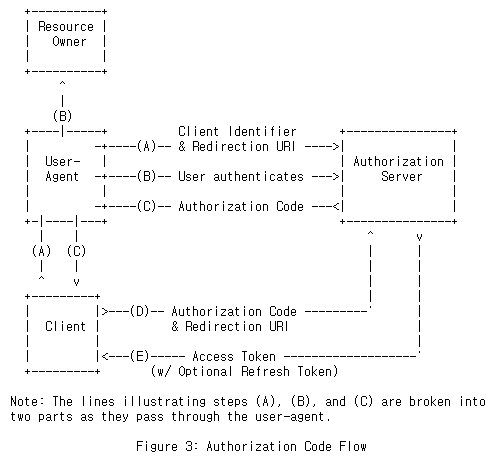

# PKCE
픽시로 발음한다고 한다. OAuth2 Authorization Code Grant Flow 에서 좀 더 강화된 보안을 제공해주는 확장 버전. Authorization Code Grant Flow 과정에서 Authorization Code가 탈취당했을 때 Access Token을 발급하지 못하도록 막아줌.



Code Verifier 와 Code Challenge 는 client 가 생성
```
Code Verifier 생성 규칙

48 ~ 128 글자수를 가진 Random String.
A-Z a-z 0-9 -._~ 문자들로만 구성됨

Code Challenge 생성 규칙

선택한 Hash 알고리즘으로 Code Verifier를 Hashing 한 후 Base64 인코딩을 한 값

ex) Base64Encode(Sha256(Code Verifier))
```
- 위의 A 단계에서 Code Challenge 와 hash 함수 종류를 쿼리 파라미터에 추가
```
https://authorization-server.com/authorize?
  response_type=code
  &client_id=CKw2bkLjI-6Bs3wwgl7OBUgz
  &redirect_uri=https://www.oauth.com/playground/authorization-code-with-pkce.html
  &scope=photo+offline_access
  &state=w7pneFNa8aF2i5f_
  &code_challenge=HVoKJYs8JruAxs7hKcG4oLpJXCP-z1jJQtXpQte6GyA
  &code_challenge_method=S256
```
- 위의 D, E 단계에서 Code Verifier 를 전달
```
POST https://authorization-server.com/token

grant_type=authorization_code
&client_id=CKw2bkLjI-6Bs3wwgl7OBUgz
&client_secret=F3n7fXMtVwGJ5lXqTmwUHoNUp6O0qN1YYjkRkrQ7ZD6Kbnvt
&redirect_uri=https://www.oauth.com/playground/authorization-code-with-pkce.html
&code=Uyz9EU-QeRfW4Kt-nUnq4s7NxMuFjJLhT3DVHD6VyLn8Mc5Q
&code_verifier=EAp91aanXdoMcoOc2Il55H3UDDIV909k9olEEcl6L24J6_9X
```
- 인증 서버가 A 단계에서 전달했던 code_challenge 와 D, E 단계에서 전달한 code_verifier 를 해싱하고 base64 인코딩하여 비교

- 검증이 되면 access token 발급

> https://www.oauth.com/playground/authorization-code-with-pkce.html 해당 링크에서 PKCE 과정을 체험해 볼 수 있음


# Authentication, Authorization
Authentication: 인증
Authorization: 허가, 인가